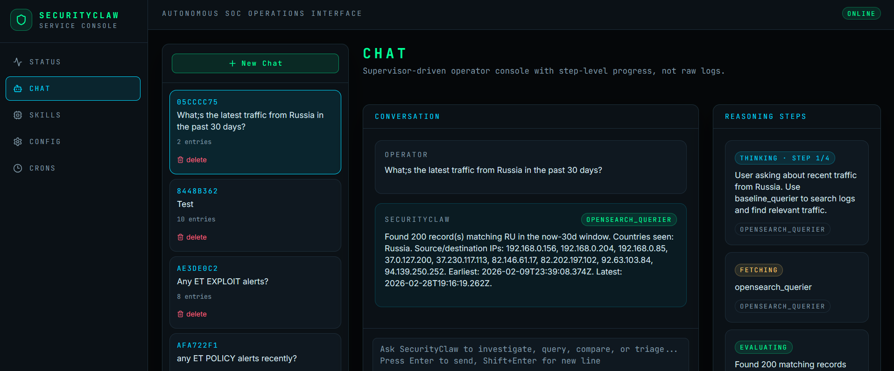

# SecurityClaw — Autonomous SOC Agentic Framework

A modular, skill-based autonomous Security Operations Center (SOC) agent that monitors OpenSearch/Elasticsearch data, builds RAG-based behavioral memory, and validates real-time anomalies using LLMs.

## Features

* **Skill Modularity** — Capabilities as isolated folders with `logic.py` (Python) + `instruction.md` (LLM guidance)  
* **Heartbeat Loop** — Cron-like scheduler: 1-minute anomaly watcher, 6-hour memory builder  
* **Provider Agnostic** — Swap OpenSearch↔Elasticsearch via config  
* **RAG-Based Memory** — Vector embeddings stored in OpenSearch; context-aware threat analysis  
* **LangGraph Orchestration** — Multi-step DECIDE→EXECUTE→EVALUATE supervisor loop implemented as a `StateGraph`; conversation and chat working memory checkpointed to SQLite via `SqliteSaver`  
* **Working Memory** — Interactive chat working memory stays inside LangGraph state and is checkpointed in `data/conversations.db`; the scheduler/CLI runtime now uses the same checkpoint-backed model via `data/runtime_memory.db`  
* **Conversation-based Investigations** — Investigate threats through an interactive chat interface with real-time LLM reasoning steps, routing guards, and RAG context retrieval  
* **Web Interface** — Modern React-based UI for chat, memory visualization, and skill dispatch  

---

## Web Interface



---

## Quick Start

### 0. Prerequisites

- **Python 3.11+** (check with `python --version`)
- **Git** (for cloning the repo)
- **OpenSearch 2.x or Elasticsearch 8.x** (or use mock for testing)
- **Ollama** (for LLM provider)
- **4GB+ RAM** (recommended for Ollama models; 8GB+ for production)
- **~2GB disk space** for models and vector indices

### 0.5 Quick Ollama Setup

The current example configuration in [config.yaml.example](config.yaml.example) uses:

- `qwen2.5:7b-instruct-q4_K_M` for chat/reasoning
- `nomic-embed-text:latest` as the lightweight local auxiliary model for embeddings referenced by the sample config

Quick setup:

```bash
curl -fsSL https://ollama.com/install.sh | sh
ollama serve
ollama pull qwen2.5:7b-instruct-q4_K_M
ollama pull nomic-embed-text:latest
```

### 1. Create Virtual Environment & Install Dependencies

**Step 1a**: Clone the repository
```bash
git clone https://github.com/SecurityClaw/SecurityClaw.git
cd SecurityClaw
```

**Step 1b**: Create a Python virtual environment
```bash
# Using venv (built-in)
python3.11 -m venv .venv

# Or using virtualenv (if installed)
virtualenv .venv
```

**Step 1c**: Activate the virtual environment
```bash
# On Linux/macOS
source .venv/bin/activate

# On Windows (PowerShell)
.venv\Scripts\Activate.ps1

# On Windows (Command Prompt)
.venv\Scripts\activate.bat
```

**Step 1d**: Install Python dependencies
```bash
pip install -r requirements.txt

# Or using Pipenv (if you prefer):
pipenv install --dev
```

**Verify installation**:
```bash
python -c "import main; import core; print('✓ Dependencies OK')"
```

### 2. Interactive Onboarding

```bash
.venv/bin/python main.py onboard
```

The wizard will guide you through:
- **Database**: Host, port, SSL, auth
- **LLM**: Ollama configuration
- **Connection testing** for both services
- **Configuration save** to `config.yaml` and `.env`

See [ONBOARDING.md](ONBOARDING.md) for details.

### 3. Start the Agent

```bash
.venv/bin/python main.py run
```

The agent will start a background scheduler and begin polling for anomalies.

### 4. View Status

In another terminal:
```bash
.venv/bin/python main.py status          # Print the compact agent memory snapshot
.venv/bin/python main.py list-skills     # Show loaded skills and intervals
.venv/bin/python main.py dispatch <skill>  # Fire a skill manually (e.g., anomaly_triage)
```

---

## Architecture

### Directory Structure

```
SecurityClaw/
├── config.yaml                 # Central DB/LLM/RAG configuration
├── .env                        # Secrets (master credentials)
├── main.py                     # CLI entrypoint
│
├── core/
│   ├── config.py              # YAML + env loader
│   ├── memory.py              # Structured memory helpers for file/state/checkpoint-backed runtimes
│   ├── runner.py              # Conductor (skill discovery, scheduling)
│   ├── scheduler.py           # APScheduler wrapper
│   ├── skill_loader.py        # Dynamic skill discovery
│   ├── db_connector.py        # OpenSearch/ES abstraction
│   ├── llm_provider.py        # Ollama provider
│   ├── rag_engine.py          # Embedding store & retrieval
│   └── chat_router/           # API-only: LangGraph StateGraph orchestrator
│
├── skills/
│   ├── network_baseliner/     # 6h: Aggregate logs → RAG vectors
│   ├── fields_baseliner/      # 1h: Catalog OpenSearch field schemas
│   ├── anomaly_triage/        # Manual: Poll AD findings → enrich → escalate
│   ├── threat_analyst/        # Manual: RAG reasoning → verdict
│   ├── opensearch_querier/    # Manual: Execute database queries
│   ├── forensic_examiner/     # Manual: Build incident timelines
│   ├── baseline_querier/      # Manual: Search behavioral baselines
│   ├── fields_querier/        # Manual: Query field schema catalog
│   └── geoip_lookup/          # Cron (Tue/Fri 2 AM UTC): Maintain MaxMind DB
│
├── data/
│   ├── conversations.db       # SQLite — LangGraph checkpoint store (conversation + chat memory)
│   ├── runtime_memory.db      # SQLite — LangGraph checkpoint store (scheduler + CLI runtime memory)
│   └── geoip/                 # MaxMind GeoLite2 database files
│
├── tests/
│   ├── conftest.py            # Shared fixtures
│   ├── mock_opensearch.py     # In-memory DB (cosine kNN)
│   ├── mock_llm.py            # Deterministic LLM (keyword-dispatched)
│   ├── data_generator.py      # Synthetic network logs & anomalies
│   └── test_*.py              # Offline tests + coverage
│
├── requirements.txt / Pipfile  # Dependencies
└── ONBOARDING.md              # Interactive setup guide
```

### Core Design Principles

| Principle | Implementation |
|-----------|---|
| **Skill Modularity** | Each skill is a folder with `logic.py` (entrypoint) and `instruction.md` (LLM system prompt) |
| **Auto-Discovery** | Runner scans `/skills` and dynamically loads all valid skills |
| **LangGraph Orchestration** | `chat_router` runs a `StateGraph` (DECIDE→EXECUTE→EVALUATE loop) compiled with `SqliteSaver`; state includes chat memory, skill results, and conversation history |
| **Stateful Memory** | Chat orchestration uses LangGraph state checkpointed at `data/conversations.db`; the scheduler and CLI runtime use the same bounded structured memory model checkpointed at `data/runtime_memory.db` |
| **Scheduled Execution** | APScheduler fires skills at intervals; intervals defined in skill `instruction.md` front-matter |
| **Provider Agnostic** | Abstract `BaseDBConnector` and `BaseLLMProvider` allow swapping vendors via config |
| **RAG Context** | Embeddings stored in vector index; retrieved during LLM analysis for behavioral context |
| **Testability** | Mock DB, LLM, and data generators enable repeatable offline tests with coverage reporting |

---

## Skill Reference

### NetworkBaseliner (6-hour cycle)

**Purpose**: Build baseline of "normal" network behavior.

**Logic**:
1. Query recent logs (e.g., last 24 hours)
2. Aggregate into summaries (typical ports, protocols, byte volumes)
3. Generate LLM-enhanced descriptions
4. Store as embedding vectors in the RAG index

**Output**: Baseline vectors used by ThreatAnalyst for context.

### AnomalyTriage (Manual)

**Purpose**: Poll anomaly detection findings and escalate high-confidence anomalies.

**Publication note**: This skill is in active validation. Convert to scheduled by adding `schedule_interval_seconds: 60` to `instruction.md`.

**Logic**:
1. Query OpenSearch AD index for new findings (cursor-based, from last poll)
2. Enrich each finding with LLM description (entity, score, severity)
3. If severity ≥ threshold: write to the escalation queue in agent memory
4. Update cursor for next poll

**Output**: Escalated findings in memory, waiting for ThreatAnalyst analysis.

### ThreatAnalyst (Manual)

**Purpose**: Analyze escalated findings using RAG context; issue verdict.

**Publication note**: This skill is in active validation. Convert to scheduled by adding `schedule_interval_seconds: 300` to `instruction.md`.

**Logic**:
1. Read the escalation queue from agent memory
2. For each finding:
   - Query RAG engine for similar baseline context
   - Build LLM prompt with finding + baseline context
   - Request verdict (TRUE_THREAT, FALSE_POSITIVE, UNKNOWN, ERROR)
3. Write verdicts and actions to "Recent Decisions"
4. If TRUE_THREAT: set "Current Focus" and trigger IR playbooks

**Output**: Verdicts with confidence, MITRE tactic mapping, recommended actions.

### GeoIPLookup (weekly refresh + on-demand lookup)

**Purpose**: Maintain a local MaxMind GeoLite2-City database and answer direct IP geolocation questions.

**Logic**:
1. On first use, download the MMDB if missing
2. Once per week, refresh it if stale
3. For a supplied IP, return local city / subdivision / country / timezone / coordinate data

**Output**: Deterministic geolocation fields from the local MaxMind DB.

### Publication Status Notes

| Skill | Status | Notes |
|-------|--------|-------|
| **chat_router** | Stable | Powers web interface and API |
| **network_baseliner** | Stable | Builds behavioral baselines from logs |
| **fields_baseliner** | Stable | Catalogs OpenSearch field schemas |
| **anomaly_triage** | In-Progress | Manual skill; enable scheduling in instruction.md |
| **threat_analyst** | In-Progress | Manual skill; enable scheduling in instruction.md |
| **opensearch_querier** | Stable | Single point of contact for DB queries |
| **forensic_examiner** | In-Progress | Timeline reconstruction; active development |
| **baseline_querier** | In-Progress | Search behavioral baselines; not publication-hardened |
| **fields_querier** | Stable | Search field schema catalog |
| **geoip_lookup** | Stable | MaxMind GeoLite2 maintenance and lookups |

**Legend**:
- **Stable**: Publication-ready; tested in production patterns
- **In-Progress**: Under active validation; feedback welcome
- **Deprecated**: Use alternative skill; kept for backwards compatibility

---

## Configuration

### config.yaml

```yaml
agent:
  name: SecurityClaw
  version: "1.0.0"
  skills_dir: skills
  log_level: INFO

scheduler:
  heartbeat_interval_seconds: 60
  memory_build_interval_hours: 6

db:
  provider: opensearch          # or: elasticsearch
  host: localhost
  port: 9200
  use_ssl: false
  verify_certs: false
  username: ""                  # Loaded from .env
  password: ""                  # Loaded from .env
  # Index configuration (configured during onboarding)
  logs_index: securityclaw-logs          # Where to scan for network logs
  anomaly_index: securityclaw-anomalies  # Where AD findings are stored
  vector_index: securityclaw-vectors     # RAG embedding store

llm:
  provider: ollama
  ollama_base_url: http://localhost:11434
  ollama_model: qwen2.5:7b-instruct-q4_K_M
  ollama_embed_model: nomic-embed-text:latest

rag:
  embedding_model: all-MiniLM-L6-v2
  top_k: 5
  similarity_threshold: 0.65

anomaly:
  detector_id: default-detector
  poll_interval_seconds: 60
  severity_threshold: 0.7
  max_findings_per_poll: 50

geoip:
  enabled: true
  db_path: data/geoip/GeoLite2-City.mmdb
  edition_id: GeoLite2-City
  update_interval_days: 7
  download_url: https://download.maxmind.com/app/geoip_download
  timeout_seconds: 60
  license_key: ""               # Loaded from .env via MAXMIND_LICENSE_KEY
```

### Index Configuration Explained

SecurityClaw works with **three indices**:

| Index | Purpose | Used By | Example |
|-------|---------|---------|---------|
| **logs_index** | Historical network logs for baseline building | NetworkBaseliner (6h cycle) | `securityclaw-logs`, `logs-*`, `filebeat-*` |
| **anomaly_index** | Anomaly Detection results (findings) | AnomalyWatcher (1m cycle) | `securityclaw-anomalies`, `.opendistro-anomaly-results*` |
| **vector_index** | RAG embeddings (normal behavior baseline) | ThreatAnalyst (5m cycle) | `securityclaw-vectors` |

**Flow:**
1. **NetworkBaseliner** → queries `logs_index` → generates summaries → stores embeddings in `vector_index`
2. **AnomalyWatcher** → polls `anomaly_index` for new findings → escalates to memory
3. **ThreatAnalyst** → reads escalations → retrieves context from `vector_index` → issues verdict

During onboarding, you can use any index names/patterns your environment provides (e.g., if your logs are in `filebeat-networking-*`, use that instead of `securityclaw-logs`).

### .env (git-ignored)

```
OPENSEARCH_USERNAME=<your-opensearch-username>
OPENSEARCH_PASSWORD=<your-opensearch-password>
OLLAMA_BASE_URL=http://localhost:11434
```

---

## CLI Commands

```bash
# Interactive setup
.venv/bin/python main.py onboard

# Start web interface + backend API + scheduler
.venv/bin/python main.py service

# Run the CLI agent (blocks; press Ctrl+C to stop)
.venv/bin/python main.py run

# Interactive chat in CLI
.venv/bin/python main.py chat

# Fire one skill immediately
.venv/bin/python main.py dispatch anomaly_triage
.venv/bin/python main.py dispatch network_baseliner
.venv/bin/python main.py dispatch threat_analyst

# View working memory
.venv/bin/python main.py status

# List skills and intervals
.venv/bin/python main.py list-skills

# Set logging level
.venv/bin/python main.py --log-level DEBUG run
```

---

## Web Interface

### Starting the Web Server

The web interface provides a modern chat-based UI for interacting with SecurityClaw skills and viewing reasoning steps.

```bash
# Activate virtual environment first
source .venv/bin/activate  # or: .venv\Scripts\activate on Windows

# Start the web server + backend API + scheduler
python main.py service
```

**Expected output**:
```
[INFO] Starting web server and API...
[INFO] Frontend available at: http://localhost:3000
[INFO] API backend available at: http://localhost:5000/api
[INFO] Scheduler running in background
[INFO] Press Ctrl+C to stop
```

### Web Interface Features

**Chat Interface** (http://localhost:3000)
- **Real-time chat**: Send questions and receive answers from SecurityClaw skills
- **Reasoning steps**: View LLM reasoning and decision-making process
- **Conversation history**: Browse and manage past conversations
- **Skill dispatch**: Manually trigger skills (anomaly_triage, threat_analyst, etc.)
- **Memory view**: Monitor the agent's working memory and findings

**API Endpoints** (http://localhost:5000/api)
- `GET /api/status` — Agent status and memory summary
- `POST /api/chat/stream` — Stream chat responses
- `GET /api/conversations` — List conversation history
- `DELETE /api/conversations/{id}` — Delete a conversation
- `GET /api/skills` — List available skills
- `POST /api/skills/{name}/dispatch` — Manually trigger a skill
- `GET /api/config` (read-only) — View masked configuration

### Accessing the Web UI

**Local access** (single machine):
- Open your browser to: **http://localhost:3000**

**Remote access** (from another machine):
1. Find the server's IP address:
   ```bash
   hostname -I        # Linux
   ipconfig            # Windows
   ifconfig            # macOS
   ```

2. Access from remote machine (replace `SERVER_IP` with actual IP):
   ```
   http://SERVER_IP:3000
   ```
   - Ensure firewall allows port 3000/5000 traffic
   - For production, use HTTPS and set up reverse proxy (nginx/Apache)

### Example: Running Headless (Server Only)

If you only want the API without opening a browser:

```bash
# Start server
python main.py service &

# In another terminal, query the API
curl http://localhost:5000/api/status

# Or use the CLI in the main terminal
python main.py dispatch threat_analyst
```

### Troubleshooting Web Server

**"Port 3000 already in use"**
```bash
# Kill the process using port 3000
lsof -ti:3000 | xargs kill -9     # Linux/macOS
netstat -ano | findstr :3000       # Windows
```

**"Cannot connect to API"**
- Verify backend is running: `curl http://localhost:5000/api/status`
- Check firewall rules
- Look for errors in the main terminal

**"Chat not responding"**
- Check LLM availability (Ollama running?)
- View logs: `python main.py --log-level DEBUG service`
- Check config.yaml for correct provider settings

---

## Testing

All tests are offline by default (mock DB + mock LLM) and now emit coverage reports via `pytest-cov`.

```bash
# Run the full suite with coverage
.venv/bin/python -m pytest

# Run a specific test file
.venv/bin/python -m pytest tests/test_rag.py -v

# Optional HTML coverage report
.venv/bin/python -m pytest --cov-report=html
```

Coverage XML is written to [coverage.xml](coverage.xml) for CI/reporting.

Current publication-prep baseline: the full suite is measured automatically, but aggregate coverage is still dragged down by in-progress modules and provider-specific adapters. Treat the report as a measurement tool, not as a claim that every skill is publication-hardened.

### What's Tested

| Layer | Tests | Notes |
|-------|-------|-------|
| **Config** | (via conftest) | YAML + env loading |
| **Scheduler** | 13 | Job registration, dispatch, intervals, cron expressions |
| **DB Abstraction** | 20 | Search, kNN, anomaly findings, bulk indexing |
| **LLM Abstraction** | 11 | Embedding, chat, canned responses |
| **RAG Engine** | 15 | Store, retrieve, context building, category filters |
| **Skill Loader** | 14 | Discovery, instruction loading, interval parsing |
| **Skills** | active coverage | Stable orchestration paths are covered; in-progress skills remain under active validation |
| **Data Generator** | 24 | Synthetic logs, anomalies, baseline chunks, embeddings |

Redundant supervisor routing tests were consolidated to keep the publication suite smaller and easier to maintain.

---

## Writing a New Skill

### Anatomy of a Skill

```
skills/my_skill/
├── logic.py          # Python
└── instruction.md    # LLM guidance
```

**logic.py**:

```python
"""
skills/my_skill/logic.py

Context dict keys:
  - db        → BaseDBConnector
  - llm       → BaseLLMProvider
  - memory    → StateBackedMemory (in-memory) or CheckpointBackedMemory (SQLite-backed)
  - config    → Config
  - skills    → dict of loaded Skill objects
"""
from pathlib import Path

SKILL_NAME = "my_skill"
INSTRUCTION_PATH = Path(__file__).parent / "instruction.md"

def run(context: dict) -> dict:
    """
    Main entry point. Called by Runner on schedule.
    
    Return a dict with status, results, etc.
    """
    db = context.get("db")
    llm = context.get("llm")
    memory = context.get("memory")
    config = context.get("config")
    
    # Your logic here
    memory.add_finding("Found something interesting")
    
    return {
        "status": "ok",
        "findings": 5,
    }
```

**instruction.md**:

```markdown
---
schedule_interval_seconds: 300
---

# My Skill

You are a security analyst specializing in [X].

When given anomalies, your job is to:
1. [Step 1]
2. [Step 2]

Respond in JSON format with:
```json
{
  "verdict": "...",
  "confidence": ...,
  "reasoning": "..."
}
```
```

---

## Extending SecurityClaw

### Add a New Skill

1. Create `skills/my_skill/` directory
2. Write `logic.py` with `run(context)` function
3. Write `instruction.md` with LLM guidance and optional `schedule_interval_seconds`
4. Restart agent or run `.venv/bin/python main.py dispatch my_skill` to test

### Add a DB Backend

1. Subclass `BaseDBConnector` in `core/db_connector.py`
2. Set `db.provider: my_db` in `config.yaml`
3. Update `build_db_connector()` factory to instantiate your class

### Add an LLM Backend

1. Subclass `BaseLLMProvider` in `core/llm_provider.py`
2. Set `llm.provider: my_llm` in `config.yaml`
3. Update `build_llm_provider()` factory to instantiate your class

---

## Troubleshooting

**"Module 'X' not found"**
```bash
.venv/bin/pip install -r requirements.txt
```

**"Cannot connect to OpenSearch"**
- Verify OpenSearch is running: `curl -u admin:admin http://localhost:9200`
- Check config.yaml host/port
- Check firewall rules

**"Cannot connect to Ollama"**
- Start Ollama: `ollama serve`
- Pull the sample models: `ollama pull qwen2.5:7b-instruct-q4_K_M && ollama pull nomic-embed-text:latest`
- Verify base URL in config.yaml

**"Skill not loading"**
- Check `/skills/<name>/logic.py` exists
- Verify `run(context)` function signature
- Check logs: `.venv/bin/python main.py --log-level DEBUG run`

**"No findings detected"**
- Seed mock DB: See `tests/conftest.py` for example synthetic data
- Check anomaly indices: `curl http://localhost:9200/_cat/indices?v`
- Verify detector ID in config.yaml

---

## Performance Notes

- **LLM Calls**: Each anomaly watcher and threat analyst cycle calls the LLM 1+ times (Ollama: ~1s per call)
- **RAG Retrieval**: kNN search is O(n) in mock; ~1ms per query on seeded DB
- **Scheduler**: Background APScheduler has minimal overhead (~1% CPU idle)

---

## Contributing

Contributions welcome! Areas for enhancement:
- [ ] Elasticsearch compatibility testing
- [ ] Advanced MITRE ATT&CK mapping
- [ ] Incident response playbook integrations
- [ ] Multi-tenant support
- [ ] API endpoint for external integrations
- [ ] Expanded web dashboard for structured memory visualization

---

## Support

For issues, questions, or feature requests, open an issue or contact the SecurityClaw team.

---

## Security / Publication Checklist

- `config.yaml`, `.env`, `data/conversations.db`, and `data/runtime_memory.db` are intended to stay local.
- Use [config.yaml.example](config.yaml.example) as the public template.
- Run a quick scan before publishing:

  git grep -nEI '(password|api[_-]?key|BEGIN [A-Z ]*PRIVATE KEY|sk-)' -- .
  git log --all -G 'password|api[_-]?key|sk-' --oneline


